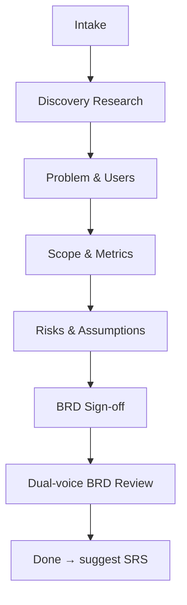

# Business Requirements (BRD)

## Shared resources

All templates, roles, sub-agents, and references are in the `deliverable` skill directory. When reading these files, look in the sibling `deliverable/` skill folder:

- `roles/*.md` → read from `deliverable/roles/*.md`
- `templates/*.md` → read from `deliverable/templates/*.md`
- `sub-agents/*.md` → read from `deliverable/sub-agents/*.md`
- `references/*.md` → read from `deliverable/references/*.md`

Draft business requirements through structured interview and research. Works section by section with your approval at every step. Pushes back on vague answers. Spawns bounded sub-agents for competitive research and feasibility checks.

Announce at start: _"I'm using the business-requirements skill to draft a BRD through structured phases with approval gates."_

<HARD-GATE>
NEVER draft the entire BRD in one shot. NEVER write multiple sections in a single turn. NEVER advance to the next phase without explicit user approval. NEVER write to disk without announcing and getting confirmation.
</HARD-GATE>

## When to use

- "write a BRD", "business requirements", "spec this feature", "requirements for X"
- After project-charter skill completes (if charter was done)

## Phases



### Intake

Five questions, one at a time:

1. **Project name and slug** (skip if charter exists)
2. **Preset** — `greenfield / feature / internal / auto`
3. **Extras — product-facing** — `prd-lite / exec-onepager / none`
4. **Extras — engineering-facing** — `rfc / acceptance-tests / none`
5. **Extras — cross-cutting** — `risks-register / planning-handoff / roadmap / none`

**Auto-bump signals:** If user mentions PII, payment data, PHI, regulated industry — note in state.md for technical-requirements skill.

### Discovery Research

Propose sub-agents from `sub-agents/`:

- `competitor-scan` — max 5 candidates, public info (~2 min, ~3k tokens)
- `feasibility-check` — library maturity, licensing (~2 min, ~2k tokens)
- `prior-art` — existing solutions, patterns (~2 min, ~2k tokens)

User approves which to run. Parallel dispatch OK. Raw → cache, distilled → `docs/requirements/research/`.

### Problem & Users

Interview using `roles/sponsor.md`, `roles/pm.md`, `roles/designer.md`. Draft:

- BRD §Problem — evidence-backed, not hand-wavy
- BRD §Users — target personas, JTBD framing

### Scope & Metrics

Interview using `roles/pm.md`, `roles/tech-lead.md`, `roles/designer.md`, `roles/qa.md`. Draft:

- BRD §Scope — explicit in/out boundaries
- BRD §Success metrics — measurable, time-bound

### Risks & Assumptions

Interview using `roles/pm.md`, `roles/tech-lead.md`, `roles/security-legal.md`\*. Draft:

- BRD §Assumptions — each tagged `[ASSUMPTION]`
- BRD §Risks — top risks only

\*security-legal loaded if auto-bump signals detected

### BRD Sign-off

Present full BRD. List all `[ASSUMPTION]` and `[OPEN]` items. Ask for sign-off.

### Dual-voice BRD Review

Dispatch `sub-agents/dual-voice-reviewer.md` for independent second opinion on scope and success metrics. Present findings. User decides what to address.

## Preset Weighting

| Section                | greenfield            | feature  | internal            |
| ---------------------- | --------------------- | -------- | ------------------- |
| §market-sizing         | required              | skip     | skip                |
| §competitive-landscape | required              | optional | skip                |
| §pricing-viability     | required              | optional | skip                |
| §target-user           | required              | required | "adopter persona"   |
| §success-metric        | required (north-star) | required | required (adoption) |

Skipped sections **omitted entirely** — no empty stubs.

## Four-Beat Rhythm

Orient → Work → Present → Approve/Edit/Revise/Kill → Commit.

- Max 3 questions per turn
- One section per present
- No silent writes
- Rushed user? Offer batch mode

## Interview Handoff

User can't answer? Suggest the **stakeholder-interview** skill to generate templates. Pause phase, resume when answers return.

## Tone

- Tight and direct. Push back on weak answers.
- Numbers over adjectives. `[ASSUMPTION]` and `[OPEN]` tags everywhere.
- Cross-link to decisions.md and open-questions.md, never duplicate.

## Roadmap Extra — Output Format

When the user selected `roadmap` as a cross-cutting extra during Intake, generate it after BRD sign-off.

After drafting the roadmap content, ask:

> _"Ready to write the roadmap. What format would you like?_
> _1. Markdown only (`roadmap.md`)_
> _2. Excel only (`roadmap.xlsx`)_
> _3. Both"_

### If Markdown (or Both)

Write `docs/requirements/roadmap.md` using `templates/roadmap.md`.

### If Excel (or Both)

Gather the following extra sections using the four-beat rhythm — one at a time, present → approve → commit.

#### Extra section: Sprint grid

Ask: how many sprints does the roadmap cover? For each sprint: name (e.g. "Sprint 1") and date range (e.g. "01/05 - 14/05").

#### Extra section: Releases (optional)

Ask: are there named releases tied to specific sprints? If yes, for each release: release name and which sprint it lands in.

#### Extra section: Feature timeline

For each feature or work item on the roadmap, ask which sprints it is in development (D) vs released (R). Use the Now/Next/Later items from the roadmap content as the feature list. For each:

- Tool / feature group name (e.g. "Auth", "Billing")
- Element name (the specific feature)
- Sub-element (optional — for nested items)
- Per-sprint status: `D` (development), `R` (release), or leave blank

After all extra sections are approved, write `docs/requirements/roadmap-data.json` with this shape:

```json
{
  "project_name": "<name>",
  "date": "<YYYY-MM-DD>",
  "sprints": [{ "name": "Sprint 1", "dates": "01/05 - 14/05" }],
  "releases": [{ "name": "Release 1", "sprint": "Sprint 2" }],
  "features": [
    {
      "tool": "",
      "element": "",
      "sub_element": null,
      "timeline": { "Sprint 1": "D", "Sprint 2": "R" }
    }
  ]
}
```

Then run:

```bash
"$DELIVERABLE_ROOT/skills/deliverable/bin/excel-export" roadmap docs/requirements/roadmap-data.json
```

This writes `docs/requirements/roadmap.xlsx`.

## Next step

_"BRD complete. Ready for the technical spec? Say 'write technical requirements' to continue."_
