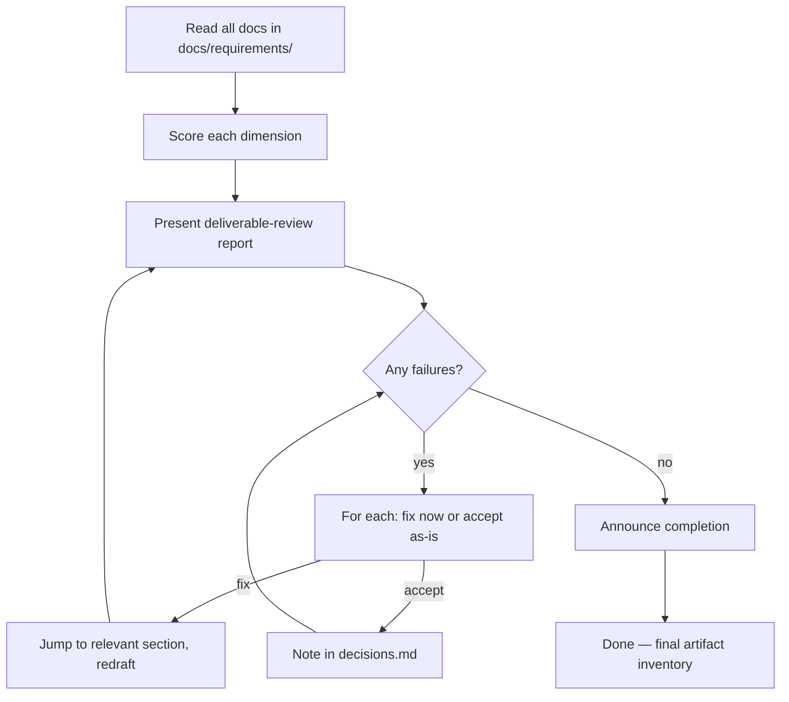

# Requirements Review

## Shared resources

All templates, roles, sub-agents, and references are in the `deliverable` skill directory. When reading these files, look in the sibling `deliverable/` skill folder:

- `roles/*.md` → read from `deliverable/roles/*.md`
- `templates/*.md` → read from `deliverable/templates/*.md`
- `sub-agents/*.md` → read from `deliverable/sub-agents/*.md`
- `references/*.md` → read from `deliverable/references/*.md`

Final quality gate. Reviews all produced documents for consistency, completeness, and quality. Scores each dimension, flags failures, and offers to fix them.

Announce at start: _"I'm using the deliverable-review skill to audit your requirements documents."_

## When to use

- "deliverable-review requirements", "audit the BRD", "check the docs", "quality check"
- After deliverable-critic completes
- Anytime — works on any existing docs in `docs/requirements/`

## Prerequisites

Reads everything in `docs/requirements/`. At minimum needs `brd.md`. Works with whatever exists.

## Review dimensions

| Dimension                | What to check                                                                                                         | Scoring                 |
| ------------------------ | --------------------------------------------------------------------------------------------------------------------- | ----------------------- |
| **Completeness**         | Every section has real content. No `[DRAFT — not started]` remaining. No empty stubs.                                 | pass / fail per section |
| **Cross-link integrity** | Every `[ASSUMPTION]` → open-questions.md. Every decision → decisions.md. Every `[OPEN]` tracked.                      | pass / fail per tag     |
| **Internal consistency** | BRD scope matches SRS architecture. Success metrics align with SLOs. Decisions don't contradict.                      | list contradictions     |
| **Measurability**        | Success metrics have numbers and timeframes. SLOs are numeric. No vague adjectives without quantification.            | flag weak metrics       |
| **Preset compliance**    | Sections match preset weighting. Skipped sections fully omitted. Required sections present and substantive.           | pass / fail per section |
| **Downstream readiness** | planning-handoff.md: work items prioritized, dependencies mapped. roadmap.md: horizons populated, milestones defined. | pass / fail             |

## Flow

### Step 1: Read all docs

Scan `docs/requirements/` for all artifacts. Note what exists and what's missing.

### Step 2: Score

Run each dimension check. Produce a scorecard.

### Step 3: Present report

Show findings per dimension. For each failure, explain what's wrong and where.

### Step 4: Fix or accept

For each failure:

- **Fix now** — redraft the problematic section
- **Accept as-is** — note in decisions.md with rationale

### Step 5: Completion

When all dimensions pass (or accepted), announce:

- Final list of all artifacts with paths
- Count of decisions made
- Count of open questions remaining
- Overall quality assessment

## When auto-bump signals detected

Also dispatch `sub-agents/red-team-deliverable-critic.md` for an independent security-focused deliverable-review. Present both findings.

## Tone

- Objective. Score against concrete criteria, not opinions.
- Flag issues clearly — "BRD §Success metrics: 'improve user experience' is not measurable. Needs a number and timeframe."

## Next step

_"Requirements deliverable-review complete. All documents are in `docs/requirements/`. Ready for implementation planning."_
