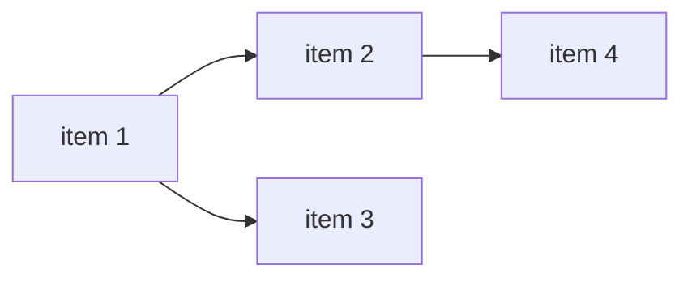

# Roadmap — <project name>

> Generated from: charter.md, brd.md, srs.md, decisions.md
> Date: YYYY-MM-DD

## Horizons

### Now (0-4 weeks)

<Work items that should start immediately. High confidence, well-defined scope.>

1. <item> — owner: <role>, depends on: <nothing | item>, constraint: <X>
2. <item> — owner: <role>, depends on: <item>

### Next (4-12 weeks)

<Work items that follow. Medium confidence, scope may refine.>

1. <item> — owner: <role>, depends on: <now items>
2. <item> — owner: <role>

### Later (12+ weeks)

<Work items that are planned but not yet detailed. Lower confidence.>

1. <item> — depends on: <next items>
2. <item>

## Dependencies

## Milestones

| Milestone     | Target date | Criteria            |
| ------------- | ----------- | ------------------- |
| <milestone 1> | YYYY-MM-DD  | <what must be true> |
| <milestone 2> | YYYY-MM-DD  | <what must be true> |

## Open risks affecting timeline

<From decisions.md accepted risks and open-questions.md unresolved items that could shift the roadmap.>

## Review cadence

<How often this roadmap should be revisited. Suggested: every 2 weeks during active development.>
