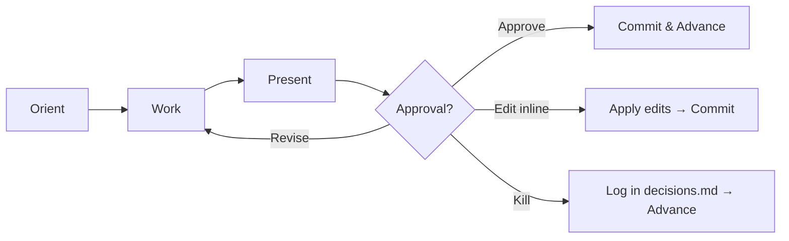

# Project Charter

## Shared resources

All templates, roles, sub-agents, and references are in the `deliverable` skill directory. When reading these files, look in the sibling `deliverable/` skill folder:

- `roles/*.md` → read from `deliverable/roles/*.md`
- `templates/*.md` → read from `deliverable/templates/*.md`
- `sub-agents/*.md` → read from `deliverable/sub-agents/*.md`
- `references/*.md` → read from `deliverable/references/*.md`

Establish the portfolio-level justification before diving into requirements. Answers: why are we investing in this? Who has authority? What kills this project?

Announce at start: _"I'm using the project-charter skill to establish the business-level justification for this initiative."_

<HARD-GATE>
NEVER draft the entire charter in one shot. NEVER write multiple sections in a single turn. NEVER write to disk without announcing and getting confirmation.
</HARD-GATE>

## When to use

- "project charter", "initiative brief", "why are we doing this"
- Starting a greenfield project — charter before BRD
- Stakeholders need a go/no-go decision document

## Four-Beat Rhythm

Every section follows:



## Flow

1. **Project name and slug** — auto-suggest from git remote or folder
2. **Interview** using `roles/sponsor.md` — business justification, vision, budget of belief, go/no-go criteria
3. **Draft sections** one at a time using `templates/charter.md`:
   - Business justification
   - Vision
   - Objectives (3-5, measurable)
   - Scope boundary (in/out)
   - Key stakeholders (role, person, authority)
   - Constraints (timeline, budget, regulatory, technical)
   - Success criteria
   - Risks (high-level)
   - Go/no-go criteria
4. **Each section**: present → approve/edit/revise/kill → commit
5. **On completion**: ask output format (see Output Format section below), then write artifacts and update `state.md`

## Slug derivation

1. `git config --get remote.origin.url` → normalize (e.g., `github.com/acme/widget` → `acme-widget`)
2. Fallback: current folder basename
3. Collision: append short hash of absolute path

## Tone

- Tight and direct. No corporate hedging.
- Push back on vague justifications — "everyone wants this" is not evidence.
- Match user's language.

## Output Format

After all charter sections are approved, ask:

> _"Ready to write. What format would you like?_
> _1. Markdown only (`charter.md`)_
> _2. Excel only (`charter.xlsx`)_
> _3. Both"_

### If Markdown (or Both)

Write `docs/requirements/charter.md` using `templates/charter.md`.

### If Excel (or Both)

Gather the following extra sections using the same four-beat rhythm — one at a time, present → approve → commit. Skip any section the user explicitly says they don't need.

#### Extra section: Project Summary details

Ask for the fields needed to populate the summary table:

- Client name
- Project Manager name
- PMO name
- Client Representative name
- Project start date
- Project end date
- Estimated effort (person-days)

#### Extra section: Organisation Chart

Ask: who is on the project team? For each person: name, role, who they report to.

#### Extra section: Roles & Responsibilities

For each role identified in the org chart (or the stakeholders section), ask for a bullet-point list of responsibilities. If the user already described responsibilities during the charter interview, offer to reuse them.

#### Extra section: Training Plan

Ask: is any training needed for the team or the client? For each training item: area, trainer, participants, timing.

If none needed, skip this section.

#### Extra section: Working Environments

Ask: what are the working environments for this project? Prompt for:

- Hardware / machines
- Development environment (OS, IDE, cloud)
- Testing environment / devices
- Coding standards
- Programming languages & frameworks
- Project management tools
- Source control

#### Extra section: Communication Plan

Two parts:

1. **Meetings** — for each recurring meeting: name, purpose, frequency, attendees, agenda
2. **Reports** — for each report: name, description, sender, receiver, tool/channel

After all extra sections are approved, write `docs/requirements/charter-data.json` with this shape:

```json
{
  "project_name": "<name>",
  "date": "<YYYY-MM-DD>",
  "version": "1.0",
  "project_summary": {
    "project_name": "", "client": "", "project_manager": "",
    "pmo": "", "client_representative": "",
    "start_date": "", "end_date": "", "effort": ""
  },
  "org_chart": [{ "name": "", "role": "", "reports_to": "" }],
  "roles": [{ "role": "", "responsibilities": [""] }],
  "scope": "",
  "constraints": "",
  "assumptions": "",
  "risks": "",
  "training_plan": [{ "area": "", "trainer": "", "participants": "", "when": "" }],
  "environments": [{ "resource": "", "note": "" }],
  "meetings": [{ "name": "", "purpose": "", "frequency": "", "attendees": "", "agenda": "" }],
  "reports": [{ "name": "", "description": "", "sender": "", "receiver": "", "tool": "" }]
}
```

Then run:

```bash
"$DELIVERABLE_ROOT/skills/deliverable/bin/excel-export" charter docs/requirements/charter-data.json
```

This writes `docs/requirements/charter.xlsx`.

## Next step

_"Charter complete. Ready to start the BRD? Say 'write business requirements' to continue."_
