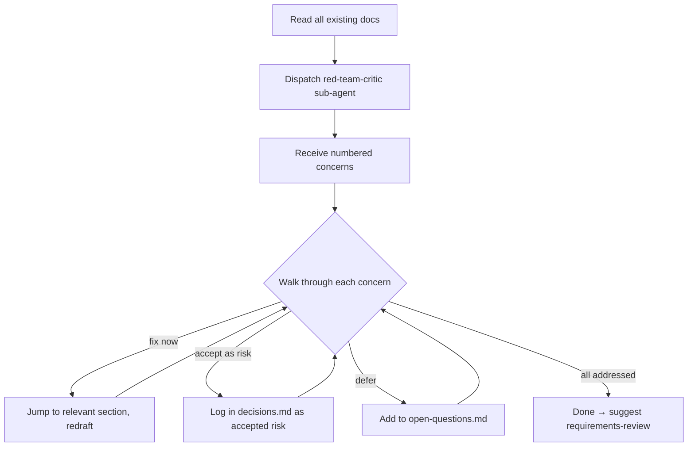

# Requirements Critic

## Shared resources

All templates, roles, sub-agents, and references are in the `deliverable` skill directory. When reading these files, look in the sibling `deliverable/` skill folder:

- `roles/*.md` → read from `deliverable/roles/*.md`
- `templates/*.md` → read from `deliverable/templates/*.md`
- `sub-agents/*.md` → read from `deliverable/sub-agents/*.md`
- `references/*.md` → read from `deliverable/references/*.md`

Adversarial review of your requirements. Finds what's wrong, missing, or weak — then walks through each concern with you to decide: fix now, accept as risk, or defer.

Announce at start: _"I'm using the requirements-critic skill to challenge your requirements and find blind spots."_

## When to use

- "red-team this", "challenge these requirements", "what's wrong with this spec"
- "stress-test the BRD", "find holes in the SRS"
- After technical-requirements skill completes
- Anytime the user wants adversarial review of existing docs

## Prerequisites

Reads from `docs/requirements/`:

- `brd.md` (required — at minimum)
- `srs.md` (if exists)
- `decisions.md` (if exists)
- `open-questions.md` (if exists)

If no docs exist, tell the user and suggest business-requirements first.

## Flow

### Step 1: Dispatch sub-agent

Read `sub-agents/red-team-critic.md` and dispatch with:

- Full content of brd.md, srs.md, decisions.md, open-questions.md
- Scope: Cagan's four risks (read `references/cagan-four-risks.md`), Hyrum's Law traps (read `references/hyrum-law-checklist.md`), operational gaps
- Budget: ~5 min, ~5k tokens

### Step 2: Present concerns

Sub-agent returns numbered concerns, each classified:

- **blocker** — must resolve before implementation
- **major** — significant risk if ignored
- **minor** — worth noting, won't block

Present summary first, then walk through one at a time.

### Step 3: Address each concern

For each concern, ask the user:

- **Fix now** — jump back to the relevant section, redraft with the concern addressed
- **Accept as risk** — log in decisions.md as accepted risk with rationale
- **Defer** — add to open-questions.md for later

### Step 4: Completion

After all concerns addressed, summarize:

- How many fixed, accepted, deferred
- Updated decisions.md and open-questions.md
- Overall assessment: ready for implementation or not

## Tone

- Direct and honest. The point is to find problems, not validate.
- Present concerns without softening — "This success metric is unmeasurable" not "You might want to consider..."
- But respect the user's final call on accept-as-risk decisions.

## Next step

_"Red-team review complete. Ready for a quality check? Say 'review requirements' to continue."_
