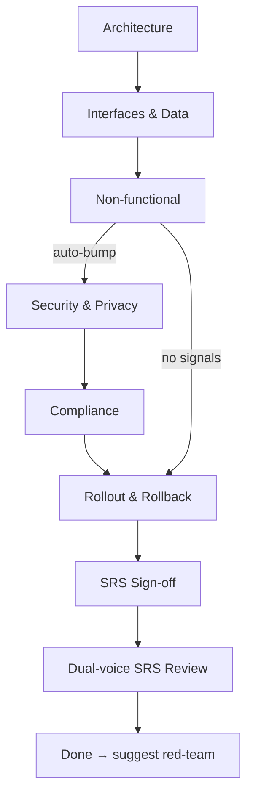

# Technical Requirements (SRS)

## Shared resources

All templates, roles, sub-agents, and references are in the `deliverable` skill directory. When reading these files, look in the sibling `deliverable/` skill folder:

- `roles/*.md` → read from `deliverable/roles/*.md`
- `templates/*.md` → read from `deliverable/templates/*.md`
- `sub-agents/*.md` → read from `deliverable/sub-agents/*.md`
- `references/*.md` → read from `deliverable/references/*.md`

Draft software requirements based on an approved BRD. Covers architecture, interfaces, data, NFRs, security, compliance, and rollout — each section drafted with your approval.

Announce at start: _"I'm using the [deliverable] srs skill to draft an SRS based on the approved BRD."_

<HARD-GATE>
NEVER draft the entire SRS in one shot. NEVER write multiple sections in a single turn. NEVER advance without user approval. NEVER write to disk without confirmation.
</HARD-GATE>

## When to use

- "write an SRS", "technical spec", "architecture doc", "engineering requirements"
- After brd skill completes

## Prerequisites

Reads `docs/requirements/brd.md` on start. If no BRD exists, suggest running brd first.

## Phases

### Architecture

Interview using `roles/tech-lead.md`. Reference `references/google-design-doc-patterns.md`. Draft:

- SRS §Architecture — main components, how they relate

### Interfaces & Data

Interview using `roles/tech-lead.md`. Draft:

- SRS §Interfaces — APIs, contracts, versioning strategy
- SRS §Data — data model, storage, retention, classification

### Non-functional

Interview using `roles/tech-lead.md`, `roles/sre.md`, `roles/qa.md`, `roles/security-legal.md`\*. Draft:

- SRS §SLOs — numeric targets, always
- SRS §Security — threat model sketch
- SRS §Privacy — data classification
- SRS §Observability — logs, metrics, traces, alerts
- SRS §Testability — what must be testable, test surfaces

\*security-legal if auto-bump signals detected

### Security & Privacy (auto-bump only)

Triggered when state.md has auto-bump signals. Interview using `roles/security-legal.md`. Draft:

- Deep threat model, data classification, encryption, audit trail
- Added to SRS §Security and §Privacy sections

### Compliance (auto-bump only)

Interview using `roles/security-legal.md`. Draft:

- Applicable regulations, evidence requirements, DPA status
- Added to SRS §Compliance section

### Rollout & Rollback

Interview using `roles/sre.md`. Draft:

- SRS §Rollout — staged? feature-flagged? percentages and durations
- SRS §Rollback — explicit abort criteria

### SRS Sign-off

Present full SRS. List all `[ASSUMPTION]` and `[OPEN]` items. Ask for sign-off.

### Dual-voice SRS Review

Dispatch `sub-agents/dual-voice-reviewer.md` for independent second opinion on architecture and NFRs. Present findings.

## Preset Weighting

| Section           | greenfield | feature  | internal |
| ----------------- | ---------- | -------- | -------- |
| §integration      | light      | heavy    | medium   |
| §migration-compat | skip       | required | required |
| §api-versioning   | medium     | medium   | heavy    |
| §deprecation      | optional   | required | required |

## Four-Beat Rhythm

Same as brd: Orient → Work → Present → Approve → Commit. One section at a time, no silent writes.

## Tone

- Engineering-precise. No vague "it should be fast" — give numbers.
- Every decision gets an alternatives-considered entry in decisions.md.
- Reference `references/hyrum-law-checklist.md` when reviewing interfaces.

## Next step

_"SRS complete. Ready for adversarial review? Say 'red-team this' to continue."_
