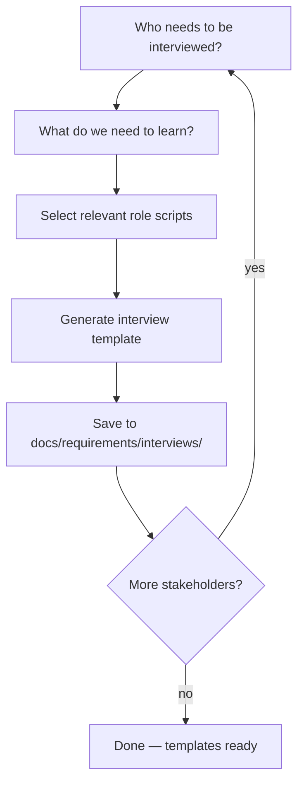

# Stakeholder Interview

## Shared resources

All templates, roles, sub-agents, and references are in the `deliverable` skill directory. When reading these files, look in the sibling `deliverable/` skill folder:

- `roles/*.md` → read from `deliverable/roles/*.md`
- `templates/*.md` → read from `deliverable/templates/*.md`
- `sub-agents/*.md` → read from `deliverable/sub-agents/*.md`
- `references/*.md` → read from `deliverable/references/*.md`

Generate structured interview templates for real stakeholders. When you don't have the answers, this skill creates the right questions — with context, examples of good answers, and space for responses. Take the template offline, interview the stakeholder, bring it back.

Announce at start: _"I'm using the stakeholder-interview skill to prepare interview templates for your stakeholders."_

## When to use

- "I need to ask the CTO", "prepare interview questions", "I don't know, let me check"
- "interview the users", "talk to stakeholders first"
- During any other deliverable skill when the user can't answer
- Standalone — user wants to prepare for stakeholder conversations

## Flow



### Step 1: Identify stakeholders

Ask: who needs to be interviewed? Map each person to a role:

- Executive / sponsor → `roles/sponsor.md`
- Product manager → `roles/pm.md`
- Technical lead / architect → `roles/tech-lead.md`
- Designer / UX researcher → `roles/designer.md`
- QA / test lead → `roles/qa.md`
- SRE / ops → `roles/sre.md`
- Legal / security / compliance → `roles/security-legal.md`

### Step 2: Determine what we need to learn

Check context:

- If called from another skill (brd, srs), use the current phase's open questions
- If standalone, ask what topics need answers

### Step 3: Generate template

Use `templates/interview.md` structure. Pull questions from the relevant role script's question bank. Customize:

- **Context for interviewer** — 2-3 sentences to set up the conversation
- **Each question** includes: why we need this, what a good answer looks like, space for the answer
- **Follow-up notes** section for unexpected insights

### Step 4: Save

Write to `docs/requirements/interviews/YYYY-MM-DD-<role>-<topic>.md`

If called from another skill, also update `state.md` to record the pause and what's pending.

### Multiple stakeholders

Can generate templates for several stakeholders in one session. Each gets its own file.

## Template format

```markdown
# Interview: <role/person> — <topic>

> Generated: YYYY-MM-DD · Project: <name>
> Purpose: <what we need to learn and why>

## Context for interviewer

<2-3 sentences to share with the stakeholder>

## Questions

### Q1: <question>

- Why we need this: <one sentence>
- Good answer looks like: <example>
- Answer: ********\_********

### Q2: <question>

...

## Follow-up notes

<space for anything unexpected>

## When done

Bring this back and run the deliverable skill again —
it will detect this file and resume where you left off.
```

## Tone

- Questions should be clear enough for a non-technical stakeholder
- Include "good answer" examples so the interviewer knows what depth to aim for
- No jargon in the context section

## On return

When the user comes back with a filled template, any deliverable skill can read it from `docs/requirements/interviews/` and ingest the answers to continue.
